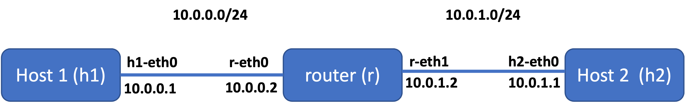

# IP addresses, forwarding and static routing

## Overview

So far you have learned how to create your own network with a few lines of python codes in `mininet`. In this lab, you will learn how to add IP addresses to network interfaces, enable IP forwarding in a machine to make it a router, and manually configure network routes (static routing) to allow nodes to communicate with each other. 

**NOTE** we'll still use mininet but *only* for creating *nodes*.

* [Part 1: IP addressing](#part-1-ip-addressing)
* [Part 2: IP forwarding](#part-2-ip-forwarding)
* [Part 3: Static routing](#part-3-static-routing)
* [Part 4: Test](#part-4-test)
* [Part 5: Tasks](#part-5-tasks)


## Learning outcomes

After completing this lab, you will:

* learn how to add IP addresses to network interfaces
* learn how to enable IP forwarding so that packets can easily move from one interface to the other. 
* learn how to manually add network routes so that hosts (from different) subnets can communicate with each other


## Part 1: IP addressing

The following python script will create a simple network topology which consists of two hosts (h1 and h2) connected to a router (r).

```python
from mininet.topo import Topo
from mininet.net import Mininet
from mininet.node import Node
from mininet.log import setLogLevel, info
from mininet.cli import CLI
from mininet.link import TCLink

class NetworkTopo( Topo ):

    def build( self, **_opts ):
        h1=self.addHost("h1",ip=None)
        r=self.addHost("r",ip=None)
        h2=self.addHost("h2",ip=None)
        self.addLink(h1,r,bw=20, delay='5ms')
        self.addLink(r,h2,bw=10, delay='5ms', max_queue_size=17, use_htb=True)

topo = NetworkTopo()
net = Mininet( topo=topo, link=TCLink )
net.start()

#net.pingAll()
CLI( net )
net.stop()

```


Run your script using: `sudo python topo-1.py`

Running your script should produce the following network with two subnets (recap: a router connects different subnets):


To see how they are connected type: `mininet> net`

Now, let's configure IP addresses. First, we should get the terminals for h1, h2 and r:

`mininet> xterm h1 h2 r`

From h1:

`h1> ifconfig`

> **`ifconfig`** stands for "interface configuration." It is used to view and change the configuration of the network interfaces on your system.


Get the interface name (h1-eth0) and assign IP address:

`h1> ip address add 10.0.0.1/24 dev h1-eth0`

This assigns the IP address 10.0.0.1/255.255.255.0 to device h1-eth0.

Now assign addresses to r's interfaces:

`r> ip address add 10.0.0.2/24 dev r-eth0`

`r> ip address add 10.0.1.2/24 dev r-eth1`

> **NOTE** r has two interfaces, connecting two subnets (h1-r) and (r-h3)


and do the same for h2:


`h2> ip address add 10.0.1.1/24 dev h2-eth0`


If you want to delete the address: replace `add` with `del`.

For example:

`h2> ip address del 10.0.1.1/24 dev h2-eth0`

Your network should have the addresses like this:




Ping r's IP (10.0.0.2) from h1 and r's IP (10.0.1.2) from h2. 

> Q. Does it work?

> Q: Can you ping h3 from h1 or vice versa? 

## Part 2: IP forwarding

If you want your linux machine (e.g, r) to act as a router, you should make it capable of forwarding packets that are meant for other destinations (not itself). Linux uses the net.ipv4.ip_forward kernel variable to enable/disable IP forwarding.

To see the current status, type the following in r's terminal:

`sysctl net.ipv4.ip_forward`

you'll get an output: 

net.ipv4.ip_forward = 0

To enable IP forwarding:

`sysctl net.ipv4.ip_forward=1`

> **`sysctl`** allows you to modify kernel parameters at runtime. Note: this will not make the change persistent; if you want your change to survive even after you restart or shut down your machine, add it in `/etc/sysctl.conf`


## Part 3: Static routing

You've already figured out that h1 cannot ping h2 because it doesn't know where to send packets destined for h2. We, therefore, have to manually add network routes for h2 in h1 so that it knows where to send the packets when it wants to communicate with h2. And, we repeat the same for h2 so that it can reach h1.

The syntax is pretty simple:

`ip route add {NETWORK/MASK} via {GATEWAYIP} dev {your_exit_interface}`

so, type the following on h1:

`h1>  ip route add 10.0.1.0/24 via 10.0.0.2 dev h1-eth0`

and on h3:

`h2>  ip route add 10.0.0.0/24 via 10.0.1.2 dev h2-eth0`

type `ip route` or `route -n` to see the routing table on h1 and/or h3:


> **NOTE** static routing is *not* useful when you have a large network. It's not feasible for the network administrators to manually configure routes. 

## Part 4: Test

Now, ping h2 from h1 and h1 from h2.

> Q: What's your result? Can you reach h1 from h2 or h2 from h1?


## Part 5: Tasks

It's time to test your knowledge. 

### Task 1

Configure your network (part 1 - part 4) for the following network:

 
```python

from mininet.topo import Topo
from mininet.net import Mininet
from mininet.node import Node
from mininet.log import setLogLevel, info
from mininet.cli import CLI
from mininet.link import TCLink


class NetworkTopo( Topo ):

    def build( self, **_opts ):
        h1=self.addHost("h1",ip=None)
        r1=self.addHost("r1",ip=None)
        r2=self.addHost("r2",ip=None)
        h2=self.addHost("h2",ip=None)
        self.addLink(h1,r1,bw=20, delay='5ms')
        self.addLink(r1,r2,bw=10, delay='5ms', max_queue_size=17, use_htb=True)
        self.addLink(r2,h2,bw=20, delay='5ms')

topo = NetworkTopo()
net = Mininet( topo=topo, link=TCLink )
net.start()

CLI( net )
net.stop()

```


### Task 2

Extend the python code and add another router after r2 (h1 - r1 - r2 - r3 - h2)
and configure your network.


Good luck!