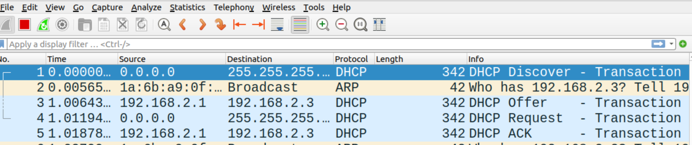

# Dynamic Host Configuration Protocol (DHCP)

## Overview

So far you have learned how to create your own network with a few lines of python codes in `mininet` and add IP addresses to network interfaces. In this lab, you'll learn how to configure `DHCP` on the router so that the hosts in the subnets can request their own IP addresses. 


* [Part 1: Required packages](#part-1-required-packages)
* [Part 2: Create the topology](#part-2-create-the-topology)
* [Part 3: Configure router](#part-3-configure-router)
* [Part 4: Run DHCP client on hosts](#part-4-run-dhcp-client-on-hosts)


## Learning outcomes

After completing this lab, you will:

* understand the fundamental concepts of `DHCP` and its role in network management.
* gain hands-on experience configuring `DHCP` settings on a router.
* learn to define and customize `DHCP` pools, IP address ranges, subnet masks, default gateways, and DNS server information on the router.
* explore the step-by-step process of how hosts dynamically request and obtain IP addresses from a `DHCP` server.
* analyze the `DHCPDISCOVER`, `DHCPOFFER`, `DHCPREQUEST`, and `DHCPACK` messages in detail.


## Part 1: Required packages

If you are using Ubuntu/Debian release, just install DHCP server with:

`sudo apt-get install isc-dhcp-server`


## Part 2: Create the topology

Create a simple network topology which consists of two hosts (h1 and h2) connected to a router (r) using the following:

```python
from mininet.topo import Topo
from mininet.net import Mininet
from mininet.node import Node
from mininet.log import setLogLevel, info
from mininet.cli import CLI
from mininet.link import TCLink

class NetworkTopo( Topo ):

    def build( self, **_opts ):
        h1=self.addHost("h1",ip=None)
        r=self.addHost("r",ip=None)
        h2=self.addHost("h2",ip=None)
        self.addLink(h1,r,bw=20, delay='5ms')
        self.addLink(r,h2,bw=10, delay='5ms', max_queue_size=17, use_htb=True)

topo = NetworkTopo()
net = Mininet( topo=topo, link=TCLink )
net.start()

#net.pingAll()
CLI( net )
net.stop()

```

Run your script using: `sudo python topo-1.py`

Running your script should produce the following network with two subnets (recap: a router connects different subnets):


To see how they are connected type: 

```console 
mininet$ net
```

## Part 3: Configure router


### Assign IP addresses

Now, let's configure IP addresses for router's two interfaces: `r-eth0` and `r-eth1`. 

First, get the terminal for r using:

```console
mininet> xterm r
```

From r's terminal:

```console
r$ ifconfig
```

> **`ifconfig`** stands for "interface configuration." It is used to view and change the configuration of the network interfaces on your system.


Now configure IP addresses:

```console
r$ ip address add 192.168.1.1/24 dev r-eth0

r$ ip address add 192.168.2.1/24 dev r-eth1
```

> **NOTE** r has two interfaces, connecting two subnets (h1-r) and (r-h3)


### Enable IP forwarding


Also, enable IP forwarding (see [addressing-lab](https://github.com/safiqul/2410/blob/main/docs/addressing/addressing-forwarding-routing.md) for more info):

```console
r$ sysctl net.ipv4.ip_forward=1
```

### Configure DHCP configuration files for addresses

Add the following lines in your `/etc/dhcp/dhcpd.conf` file to specify the range for the IP addresses to be allocated for the hosts in different subnets.

```sh
subnet 192.168.1.0 netmask 255.255.255.0 {
    range 192.168.1.2 192.168.1.254;
    option broadcast-address 192.168.1.255;
    option routers 192.168.1.1;
    INTERFACES = "r-eth0";
}
subnet 192.168.2.0 netmask 255.255.255.0 {
    range 192.168.2.2 192.168.2.254;
    option broadcast-address 192.168.2.255;
    option routers 192.168.2.1;
    INTERFACES = "r-eth1";
}
```

### Start DHCP server

Start DHCP server on r:

```console
r$ service isc-dhcp-server restart & dhcpd -f -4 -cf /etc/dhcp/dhcpd.conf &
```

> NOTE: If you encounter any issues with accessing the *DHCP lease file*, simply run the following command on the router (r):

```console 
r$ chmod 077 /var/lib/dhcp/dhcpd.leases
```

## Part 4: Run DHCP client on Hosts

Before we request IP addresses from the hosts, run wireshark on both hosts h1 and h2 to capture
the DHCP messages. 

Start terminal for h1 and h2 using:

```console
mininet$ xterm h1 h2
```

Start wireshark from h1's terminal and capture packets on `h1-eth0`:

```console
h1$ wireshark &
```

and then run `dhclient` on h1:

```console
h1$ dhclient h1-eth0
```

Your wireshark capture should like this:




Also, do the same for host h2:

```console
h2$ wireshark &
```

and then run `dhclient` on h2:

```console
h2$ dhclient h2-eth0
```


Check captured packets on wireshark and answer the following questions:

> Q. What messages are exchanged between DHCP server and client?

> Q. Are DHCP messages sent over UDP or TCP?

> Q: Which IP address did the host h1 get from the DHCP server, and why?

> Q: Which IP address did the host h2 get from the DHCP server, and why?

