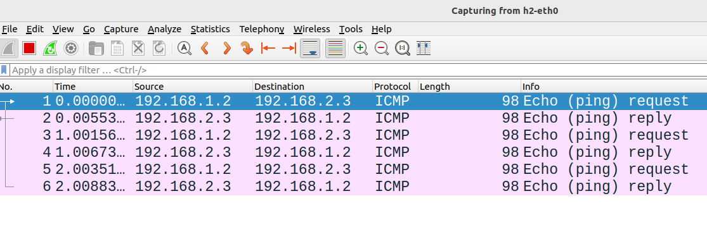
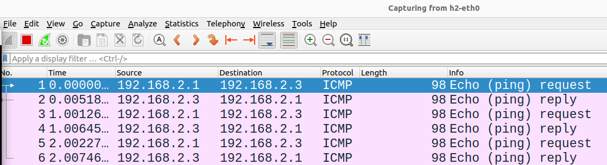

# Network Address Translation (NAT)

## Overview

So far you have learned how to create your own network with a few lines of python codes in `mininet` and configure `DHCP` on the router so that the hosts in the subnets can request their own IP addresses. In this lab, you will learn the fundamental concepts of `NAT`, configure `NAT` on a router, and explore how address translation works in practice. 


* [Part 1: Required packages](#part-1-required-packages)
* [Part 2: Create the topology](#part-2-create-the-topology)
* [Part 3: Configure IP addresses](#part-3-configure-ip-addresses)
* [Part 4: Configure NAT](#part-4-configure-nat)


## Learning outcomes

After completing this lab, you will:

* understand the fundamental concepts of `NAT`.
* gain hands-on experience on configuring `NAT` on a router.
* explore how address translation works in practice.

## Part 1: Required packages

Your Ubuntu/Debian release should have `iptables`. If it's not already installed, you can *easily* install it by executing the following command:

```console
$ sudo apt install iptables
```

`iptables` is a command-line utility used to configure packet filtering rules in the Linux kernel's netfilter framework. It allows users to define rules for filtering or manipulating network packets.
Check this [page](https://erravindrapawadia.medium.com/iptables-tutorial-beginners-to-advanced-guide-to-linux-firewall-839e10501759) for more information.


## Part 2: Create the topology

Create a simple network topology which consists of two hosts (h1 and h2) connected to a router (r) using the following:

```python
from mininet.topo import Topo
from mininet.net import Mininet
from mininet.node import Node
from mininet.log import setLogLevel, info
from mininet.cli import CLI
from mininet.link import TCLink

class NetworkTopo( Topo ):

    def build( self, **_opts ):
        h1=self.addHost("h1",ip=None)
        r=self.addHost("r",ip=None)
        h2=self.addHost("h2",ip=None)
        self.addLink(h1,r,bw=20, delay='5ms')
        self.addLink(r,h2,bw=10, delay='5ms', max_queue_size=17, use_htb=True)

topo = NetworkTopo()
net = Mininet( topo=topo, link=TCLink )
net.start()

#net.pingAll()
CLI( net )
net.stop()

```

Run your script using: `sudo python topo-1.py`

Running your script should produce the following network with two subnets:


To see how they are connected type: 

```console 
mininet$ net
```

## Part 3: Configure IP addresses 

Complete parts 3 and 4 from the [DHCP lab](https://github.com/safiqul/2410/blob/main/docs/addressing/dhcp-addressing.md).

> NOTE: If you encounter any issues with accessing the *DHCP lease file*, simply run the following command on the router (r):

```console 
r$ chmod 077 /var/lib/dhcp/dhcpd.leases
```


## Part 4: Configure NAT

Before we configure NAT, start capturing packet on h2 and 

```console
mininet$ xterm h1 h2
```

```console
h2$ wireshark &
```

Ping h2 from h1, replace `h2_IP` with the IP address of `h2`. You can find the IP address of `h2` by running the command `ifconfig` on `h2`.

```console
h1$ ping -c 3 h2_IP
```

Your wireshark capture should like this for `h2` :




Now, configure NAT on r by running the following command:

```console
r$ iptables -t nat -A POSTROUTING -o r-eth1 -s 192.168.1.0/24 -j MASQUERADE
```

The iptables command appends a rule to the `POSTROUTING` chain of the `NAT` table, specifying that packets originating from the source subnet `192.168.1.0/24` and leaving through the outbound interface r-eth1 should undergo `NAT` using the MASQUERADE target. Essentially, it means that any packets originating from devices within the `192.168.1.0/24` subnet and going out through the `r-eth1` interface will have their source IP addresses replaced with the IP address of the `r-eth1` interface, allowing these internal devices to access the external network using the IP address of the `r-eth1` interface as their source address. This setup is commonly used in scenarios where a router or firewall serves as a gateway for internal networks to access the internet using a single public IP address. 


You can check all the NAT rules with:

```console
r$ iptables -t nat -L
```

Now, ping h2 from h1 again (do not forget to replace `h2_IP` with the IP address of `h2`: you can find the IP address of `h2` by running the command `ifconfig` on `h2`).

```console
h1$ ping -c 3 h2_IP
```

Your wireshark capture should like this for `h2` :




Compare the captured packets in Wireshark and respond to the following questions:

> Q. What are the source and destination IP addresses in both captures? 

> Q. Why is the source address different in the second capture?


