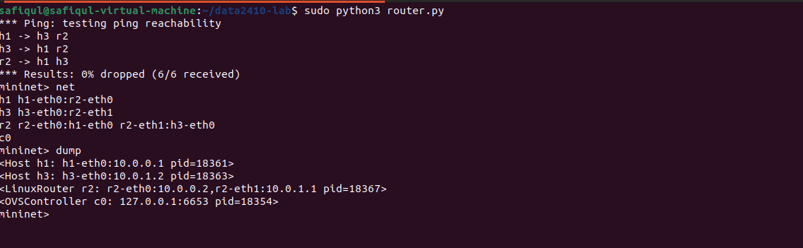
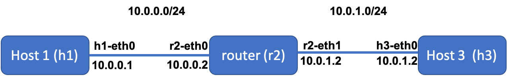
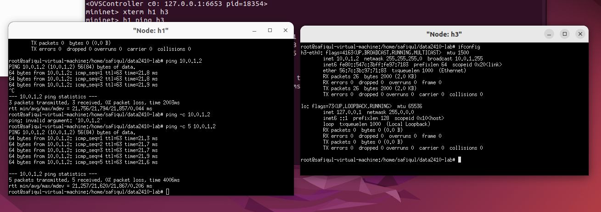

# Mininet: creating a topology

## Overview

`Mininet` allows you to create a custom topology. With a few lines of python codes, you can easily create your own network and reuse it for different experiments. In this lab, we'll learn how to create a simple topology and evaluate the performance of our own network. 

* [Part 1: Creating topologies](#part-1-creating-topologies)
* [Part 2: Running your script](#part-2-running-your-script)
* [Part 3: Performance evaluation](#part-3-performance-evaluations)
* [Part 4: Different performance parameters](#part-4-different-performance-parameters)

## Learning outcomes

After completing this lab, students will:

* learn how to create a topology
* measure the performance (end-to-end throughput and latency (**see my performance evaluation slides**)) of your own network


## Part 1: Creating Topologies

Here is a simple network topology (based on [/mininet/simpletopo](https://github.com/safiqul/2410/tree/main/mininet)) which consists of two hosts (h1 and h3) connected to a router (r2).


```python
from mininet.topo import Topo
from mininet.net import Mininet
from mininet.node import Node
from mininet.log import setLogLevel, info
from mininet.cli import CLI
from mininet.link import TCLink


class LinuxRouter( Node ):
    """A Node with IP forwarding enabled.
    Means that every packet that is in this node, comunicate freely with its interfaces."""

    def config( self, **params ):
        super( LinuxRouter, self).config( **params )
        self.cmd( 'sysctl net.ipv4.ip_forward=1' )

    def terminate( self ):
        self.cmd( 'sysctl net.ipv4.ip_forward=0' )
        super( LinuxRouter, self ).terminate()


class NetworkTopo( Topo ):

    def build( self, **_opts ):		
        h1=self.addHost("h1",ip=None)
        r2=self.addNode("r2",cls=LinuxRouter,ip=None)
        h3=self.addHost("h3",ip=None)
        self.addLink(h1,r2,params1={ 'ip' : '10.0.0.1/24' },params2={ 'ip' : '10.0.0.2/24' }, bw=10, delay='5ms')
        self.addLink(r2,h3,params1={ 'ip' : '10.0.1.1/24' },params2={ 'ip' : '10.0.1.2/24' }, bw=10, delay='5ms', max_queue_size=17)

topo = NetworkTopo()
net = Mininet( topo=topo, link=TCLink )
net.start()

#ip route add ipA via ipB dev INTERFACE
#every packet going to ipA must first go to ipB using INTERFACE
net["h1"].cmd("ip route add 10.0.1.2 via 10.0.0.2 dev h1-eth0")
net["h3"].cmd("ip route add 10.0.0.1 via 10.0.1.1 dev h3-eth0")
#this command is just to r3 ping r2 work, because it will use the correct ip
net["h3"].cmd("ip route add 10.0.0.2 via 10.0.1.1 dev h3-eth0")
net.pingAll()
CLI( net )
net.stop()
```

Important classes, methods, functions and variables in the above code include:

`Topo`: the base class for Mininet topologies

`build()`: The method to override in your topology class. Constructor parameters (n) will be passed through to it automatically by `Topo.__init__()`. This method creates a template (basically a graph of node names, and a database of configuration information) which is then used by Mininet to create the actual topology.

`addHost()`: adds a host to a Topo and returns the host name

`addNode()`: adds a node to a Topo and returns the host name. We set cls=LinuxRouter for node r2 to make it a router. 

`addLink()`: adds a bidirectional link to Topo (and returns a link key, but this is not important). Links in Mininet are bidirectional unless noted otherwise. you can also set ip addresses of the hosts/nodes, performance parameters (such as bandwidth, one-way-delay).  adds a bidirectional link with bandwidth=10 Mbit, delay=5ms, with a maximum queue size of 17 packets using the Hierarchical Token Bucket rate limiter and netem delay/loss emulator. The parameter bw is expressed as a number in Mbit; delay is expressed as a string with units in place (e.g. '5ms', '100us', '1s'); loss is expressed as a percentage (between 0 and 100); and max_queue_size is expressed in packets.

`Mininet`: main class to create and manage a network

`start()`: starts your network

`pingAll()`: tests connectivity by trying to have all nodes ping each other

`stop()`: stops your network


## Part 2: Running your script

Running your script should produce something like this:



Now you get the following topology:



# Part 3: Performance Evaluations

You have already learned how to use `iperf` and `ping`. Let's use them now to measure
the round-trip time (RTT) and network bandwidth. 

## Ping
Now ping h3 from h1 and
look at the round-trip time. 



Get the terminals for h1 and h3:

`mininet> xterm h1 h3`

Get the IP address of h3:

`h3> ifconfig`

Now ping h3 from h1's terminal, type:

`h1> ping -c 5 10.0.1.2`


> **Q: What is the round-trip time here? Can you explain why?**


## Bandwidth

To operate iPerf in a server mode, run the following command on h3:

`iperf -s -i 1`

To operate iPerf in a client mode, run the following command on h1:

`iperf -c 10.0.1.2 -i 1`

> **Q: What is the estimated bandwidth here?** 

By default, iperf uses TCP. Let's use UDP at the server side (h3), run:

`iperf -s -u`

at the client side (h1), run:

`iperf -c 10.0.1.2 -u -b 20M`

`-b` specifies the rate. 

> **Q: What is the output on h1? Can you explain?** 

# Part 4: Different performance parameters

Change the bw and delay parameters to 20Mb and 25ms, respectively, and run your scripts again. Run the iperf and ping tests again and answer the following:

> **Q: What's the RTT in your ping tests? Can you explain?**

> **Q: What's the estimated bw in your iperf tests?** 


