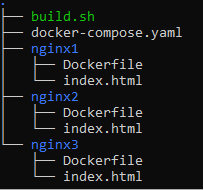
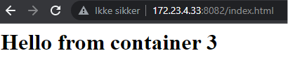

# Docker-Compose 

## Overview

[`Docker Compose`](https://docs.docker.com/compose/) allows you to define and run multi-container Docker applications. With Compose, you use a [YAML](https://www.tutorialspoint.com/yaml/index.htm) (YAML Ain’t markup language, a human readable serialisation language) file to configure your application’s services. It is easy to  create and start all the services from YAML configuration with a single command. For example,  we can create and manage webservers using a simple YAML file. 

* [Part 1: Installing Docker and Docker Compose](#part-1-installing-docker-and-docker-compose)
* [Part 2: Setting up Docker Compose](#part-2-setting-up-docket-compose)
* [Part 3: Running the Servers](#part-3-running-the-servers)

## Learning outcomes

After completing this lab, students will lear:

* the basic usage of Docker Compose
* how to create a simple YAML file
* how to build, run, and manage mutiple web servers


## Part 1: Installing Docker and Docker Compose

Install Docker Compose:

`sudo apt install docker-compose`

Check if the Docker is running with:

`sudo service docker status`

if it's not running, start Docker with:

`sudo service docker start`


## Part 2: Setting up Docker Compose

First create two files: 

1. docker-compose.yaml
2. build.sh


`docker-compose.yaml` content is here:

```Yaml
version: '3'
services:
 nginx1:
  build: nginx1/
  image: nginx1
  container_name: nginx
  tty: true
  ports:
   - "8080:80"
  networks:
   customnetwork:
    ipv4_address: 172.31.82.12


 nginx2:
  build: nginx2/
  image: nginx2
  container_name: nginx2
  tty: true
  ports:
   - "8081:80"
  networks:
   customnetwork:
    ipv4_address: 172.31.82.13


 nginx3:
  build: nginx3/
  image: nginx3
  container_name: nginx3
  tty: true
  ports:
   - "8082:80"
  networks:
   customnetwork:
    ipv4_address: 172.31.82.14
networks:
 customnetwork:
  driver: bridge
  ipam:
   config:
    - subnet: 172.31.80.0/20
```


and `build.sh` content is here:

```Bash
    #!/bin/bash
    for i in 1 2 3
    do
    mkdir nginx$i
    echo "FROM nginx:latest
    COPY ./index.html /usr/share/nginx/html/index.html" > nginx$i/Dockerfile
    echo "<html> <h1> Hello from container $i </h2> </html>" > nginx$i/index.html
    done
    docker-compose up -d
```


# Part 3: Running the Servers

First, run the build.sh script in your terminal.

Make it executable first with:

`chmod +x build.sh`

and then:

`./build.sh`


After running the the `build.sh` script, you will get a following file structure:



and run `docker ps` to see the container structure:


We now have 3 web servers running in three separate containers. To access them, go to `localhost:8080`, `localhost:8081` and `localhost:8082` in your favorite browser. 




