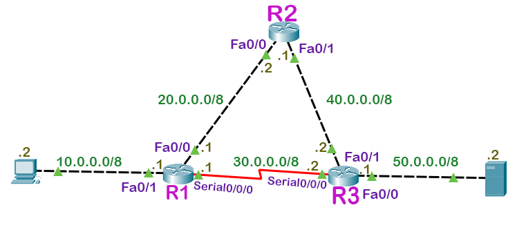
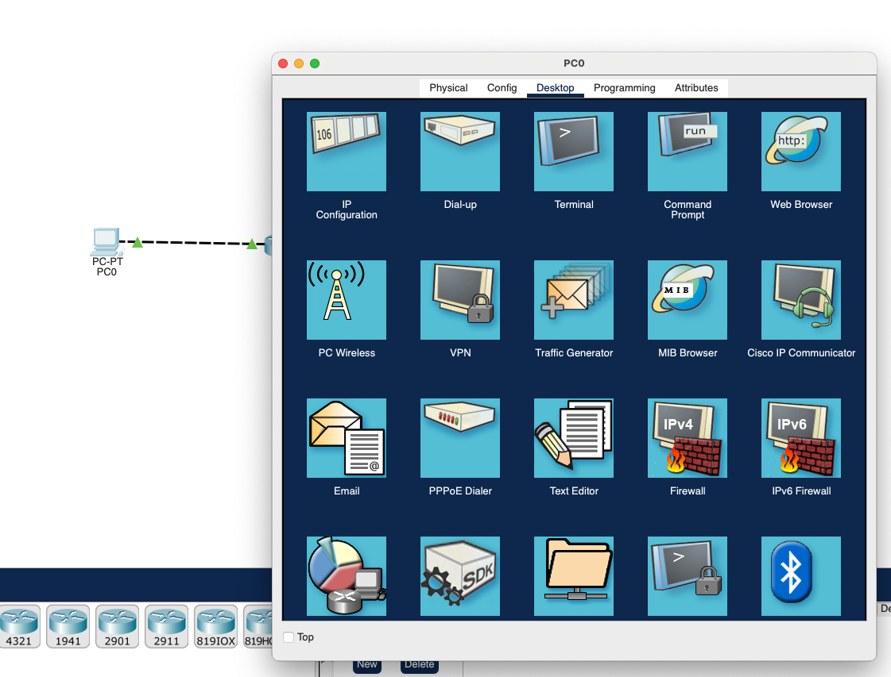
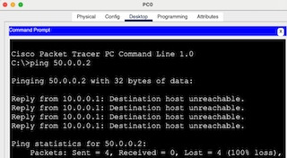
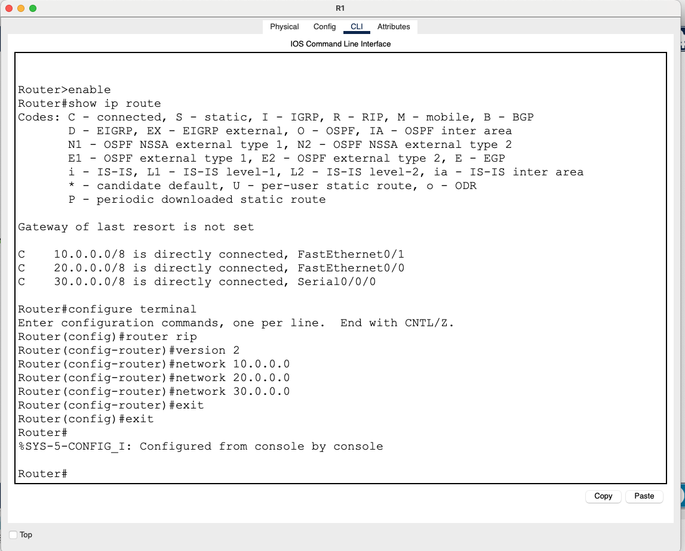
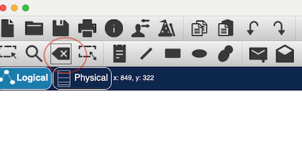

# Routing Information Protocol (RIP)

## Overview

In this lab, we'll learn how to use Cisco Packet Tracer to set up RIP (Routing Information Protocol) dynamic routing. RIP is one of the oldest distance-vector routing protocols, used in small to medium-sized networks. The objective of this lab is to gain hands-on experience in configuring and verifying RIP routing on Cisco routers.

> NOTE For the sake of simplicity and easy understanding, Mininet, is not utilized in this lab. Instead, we opt for Cisco Packet Tracer, offering a straightforward approach for learning dynamic routing.

* [Part 1: Install Packet Tracer](#part-1-install-packet-tracer)
* [Part 2: Load the topology](#part-2-load-the-topology)
* [Part 3: Test connectivity](#part-3-test-connectivity)
* [Part 4: Enable RIP routing](#part-4-enable-rip-routing)
* [Part 5: Verify RIP routing](#part-5-verify-rip-routing)
* [Part 6: Simulating network failure](#part-6-simulating-network-failure)

## Learning outcomes

After completing this lab, you will:

* Understand the basic principles of RIP (Routing Information Protocol) dynamic routing protocol.
* Enable RIP on Cisco routers and configure network advertisements.
* Check RIP routing table entries on Cisco routers using CLI commands.


## Part 1: Install Packet Tracer

Cisco Packet Tracer can be downloaded from the [Cisco Networking Academy website](https://www.netacad.com/courses/packet-tracer). You need to log in with your credentials and join this [course](https://skillsforall.com/course/getting-started-cisco-packet-tracer?courseLang=en-US) for free to download the software. If you don't have an account, sign up for free. Make sure that you download the appropriate version for your operating system (Windows, macOS, or Linux). 

Alternatively, you can download from this [page](https://www.computernetworkingnotes.com/ccna-study-guide/download-packet-tracer-for-windows-and-linux.html). However, I can't vouch for this page's reliability.


## Part 2: Load the topology

We're going to use the following topology for our lab (taken from this [page]()). 



A preconfigured lab with IP configuration is available [here](packet-tracer-lab-with-ip-configuration.pkt). Open this 
[`packet-tracer-lab-with-ip-configuration.pkt`](packet-tracer-lab-with-ip-configuration.pkt) file with Packet Tracer software.


## Part 3: Test Connectivity

Now, test if you could reach server (IP: 50.0.0.2) from PC0. Access the command prompt by clicking on the pc0 icon and selecting Desktop tab.



and ping the server:



Answer the following question:

> Q. Why can't we access the server?


## Part 4: Enable RIP routing

Access each router's CLI by clicking on it and selecting "CLI" tab. Enable RIP routing protocol using the following commands:

```console
Router> enable
Router# configure terminal
Router(config)# router rip
Router(config)# version 2
Router(config-router)# network <network_address>
Router(config-router)# exit
Router(config)# exit
Router#
```

* `configure terminal` Command is used to enter in global configuration mode.
* `router rip` command enables the RIP routing protocol.
* `version 2` enables RIP routing protocol version two. 
* `network` command allows us to specify the networks which we want to advertise. We only need to advertise the networks that are directly connected with the router.


Let's do it for R1 first. Click on R1 and select CLI. Check the routing table entries by typing `show ip route` command. This command will give us the directly connected networks which we
need to advertise. 

```console
Router>enable
Router#show ip route
Codes: C - connected, S - static, I - IGRP, R - RIP, M - mobile, B - BGP
       D - EIGRP, EX - EIGRP external, O - OSPF, IA - OSPF inter area
       N1 - OSPF NSSA external type 1, N2 - OSPF NSSA external type 2
       E1 - OSPF external type 1, E2 - OSPF external type 2, E - EGP
       i - IS-IS, L1 - IS-IS level-1, L2 - IS-IS level-2, ia - IS-IS inter area
       * - candidate default, U - per-user static route, o - ODR
       P - periodic downloaded static route

Gateway of last resort is not set

C    10.0.0.0/8 is directly connected, FastEthernet0/1
C    20.0.0.0/8 is directly connected, FastEthernet0/0
C    30.0.0.0/8 is directly connected, Serial0/0/0
```

Now, let's enable RIP for R1:

```console
Router#configure terminal
Enter configuration commands, one per line.  End with CNTL/Z.
Router(config)#router rip
Router(config-router)#version 2
Router(config-router)#network 10.0.0.0
Router(config-router)#network 20.0.0.0
Router(config-router)#network 30.0.0.0
Router(config-router)#exit
Router(config)#exit
Router#
```

A screenshot is also attached herewith:




Now do the same for R2:

```console
Router>enable
Router#show ip route
Codes: C - connected, S - static, I - IGRP, R - RIP, M - mobile, B - BGP
       D - EIGRP, EX - EIGRP external, O - OSPF, IA - OSPF inter area
       N1 - OSPF NSSA external type 1, N2 - OSPF NSSA external type 2
       E1 - OSPF external type 1, E2 - OSPF external type 2, E - EGP
       i - IS-IS, L1 - IS-IS level-1, L2 - IS-IS level-2, ia - IS-IS inter area
       * - candidate default, U - per-user static route, o - ODR
       P - periodic downloaded static route

Gateway of last resort is not set

C    20.0.0.0/8 is directly connected, FastEthernet0/0
C    40.0.0.0/8 is directly connected, FastEthernet0/1

Router#configure terminal
Enter configuration commands, one per line.  End with CNTL/Z.
Router(config)#router rip
Router(config-router)#version 2
Router(config-router)#network 20.0.0.0
Router(config-router)#network 40.0.0.0
Router(config-router)#exit
Router(config)#exit
Router#
``` 

And for R3:

```console
Router>enable
Router#show ip route
Codes: C - connected, S - static, I - IGRP, R - RIP, M - mobile, B - BGP
       D - EIGRP, EX - EIGRP external, O - OSPF, IA - OSPF inter area
       N1 - OSPF NSSA external type 1, N2 - OSPF NSSA external type 2
       E1 - OSPF external type 1, E2 - OSPF external type 2, E - EGP
       i - IS-IS, L1 - IS-IS level-1, L2 - IS-IS level-2, ia - IS-IS inter area
       * - candidate default, U - per-user static route, o - ODR
       P - periodic downloaded static route

Gateway of last resort is not set

C    30.0.0.0/8 is directly connected, Serial0/0/0
C    40.0.0.0/8 is directly connected, FastEthernet0/1
C    50.0.0.0/8 is directly connected, FastEthernet0/0

Router#configure terminal
Enter configuration commands, one per line.  End with CNTL/Z.
Router(config)#router rip
Router(config-router)#version 2
Router(config-router)#network 30.0.0.0
Router(config-router)#network 40.0.0.0
Router(config-router)#network 50.0.0.0
Router(config-router)#exit
Router(config)#exit
Router#
```


# Part 5: Verify RIP routing

Now, test if you could reach server (IP: 50.0.0.2) from PC0. Access the command prompt by clicking on the pc0 icon and selecting Desktop tab.

> Q. Can you access the server?

Also do a tracert from pc01 to the server:

```console
C:\>tracert 50.0.0.2

Tracing route to 50.0.0.2 over a maximum of 30 hops: 

  1   0 ms      0 ms      0 ms      10.0.0.1
  2   1 ms      1 ms      0 ms      30.0.0.2
  3   1 ms      1 ms      1 ms      50.0.0.2

Trace complete.
```


> Q. Can you identify the path?


Now, check the routing table entries on R1.


```console
Router#show ip route
Codes: C - connected, S - static, I - IGRP, R - RIP, M - mobile, B - BGP
       D - EIGRP, EX - EIGRP external, O - OSPF, IA - OSPF inter area
       N1 - OSPF NSSA external type 1, N2 - OSPF NSSA external type 2
       E1 - OSPF external type 1, E2 - OSPF external type 2, E - EGP
       i - IS-IS, L1 - IS-IS level-1, L2 - IS-IS level-2, ia - IS-IS inter area
       * - candidate default, U - per-user static route, o - ODR
       P - periodic downloaded static route

Gateway of last resort is not set

C    10.0.0.0/8 is directly connected, FastEthernet0/1
C    20.0.0.0/8 is directly connected, FastEthernet0/0
C    30.0.0.0/8 is directly connected, Serial0/0/0
R    40.0.0.0/8 [120/1] via 20.0.0.2, 00:00:09, FastEthernet0/0
                [120/1] via 30.0.0.2, 00:00:21, Serial0/0/0
R    50.0.0.0/8 [120/1] via 30.0.0.2, 00:00:21, Serial0/0/0

```

Now, you will be able to see two new RIP entries. 

> NOTE Routing Information Protocol (RIP) is a dynamic routing protocol that uses hop count as a routing metric to find the best path. It is a DV routing protocol that has an Administrative Distance value of 120.

Check the routing tables for R2 and R3 for R entries. 


# Part 6: Simulating network failure

Disconnect the link between R1 and R3:



Do a tracert again from pc01 to the server:

```console
C:\>tracert 50.0.0.2

Tracing route to 50.0.0.2 over a maximum of 30 hops: 

  1   0 ms      0 ms      0 ms      10.0.0.1
  2   0 ms      0 ms      0 ms      20.0.0.2
  3   0 ms      0 ms      0 ms      40.0.0.2
  4   0 ms      0 ms      0 ms      50.0.0.2

Trace complete.

```

and, answer the following question: 

> Q. Can you explain?
