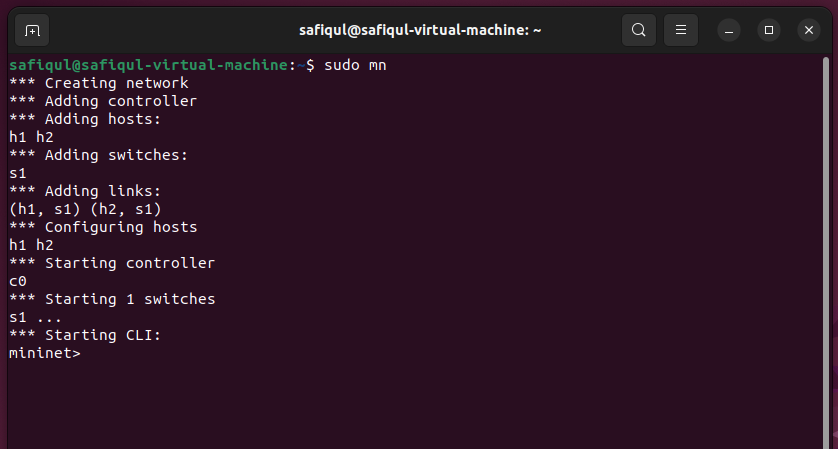
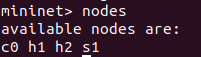
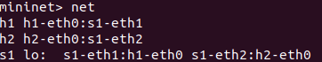
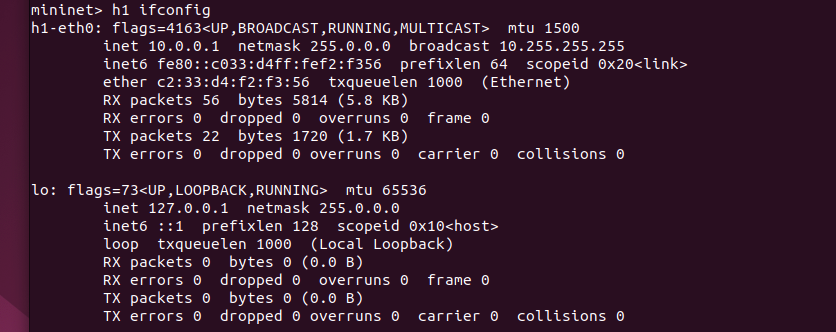
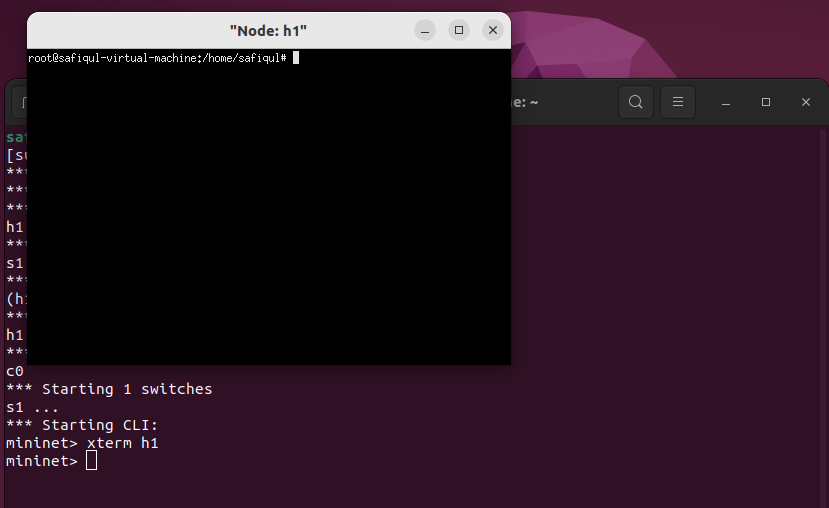
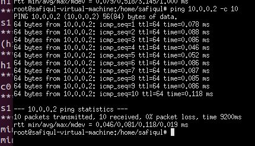
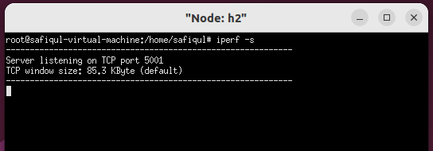
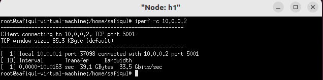
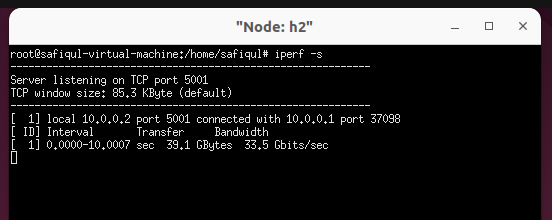

# Introduction to Mininet

## Overview

`Mininet` creates a realistic virtual network, running real kernel, switch and application code, on a single machine (VM or native), in seconds, with a single command. It's fast and you can create and run Mininet experiments by writing simple
python scripts. You can run your own application code.

From the official page: *Mininet's virtual hosts, switches, links, and controllers are the real thing – they are just created using software rather than hardware – and for the most part their behavior is similar to discrete hardware elements. It is usually possible to create a Mininet network that resembles a hardware network, or a hardware network that resembles a Mininet network, and to run the same binary code and applications on either platform.* 

In this lab, we'll learn how to use Mininet. 

* [Part 1: Installing Mininet](#part-1-installing-mininet)
* [Part 2: Running Mininet](#part-2-running-mininet)
* [Part 3: Useful commands](#part-3-useful-commands)
* [Part 4: Network utilities](#part-4-network-utilities)

## Learning outcomes

After completing this lab, students will:

* learn the basic usage of Mininet
* play with default Mininet topology
* measure the performance (end-to-end throughput and latency (**see my performance evaluation slides**)) of your virtual networks

## Part 1: Installing Mininet

It's easy to install mininet. Just follow the instructions from their [official page](http://mininet.org/download/). You can either choose option 3 (Installation from Packages) or option 1 (download a pre-packaged Mininet/Ubuntu VM). I'll *only* write about option 3.
  
### Installation from packages

If you are using a recent Ubuntu /Debian release, install mininet with just command:

`sudo apt  install mininet`

From the official page: 

If you mininet complains about openvswitch, make sure it is installed

`sudo apt  install openvswitch-switch`

`sudo service openvswitch-switch start`

If it still complains, install:

`sudo apt install openvswitch-testcontroller`

#### other useful stuff:

`sudo apt  install xterm`

`sudo apt  install traceroute`

`sudo apt  install wireshark`

`sudo apt  install iperf3`

if you encounter some process issues with openvswitch with port 6653/TCP, use the following to kill and start mininet again:

`sudo fuser -k 6653/tcp`

## Part 2: Running mininet

To start a minimal topology (2 hosts and a switch), enter the command at the terminal:

`sudo mn`

Which creates a topology like this:

A screenshot is attached here for your convenience:

If you want to see the nodes (ignore the controller c0 for now), type `nodes` :

`mininet> nodes`

If you want to display the network interfaces and link between the devices, type `net`

`mininet> net`

## Part 3: Useful commands

To execute commands at a specific device (e.g. h1), type h1 first and then command:

`mininet> h1 ifconfig`

if you want ping h2 from h1:

`mininet> h1 ping h2`

when you run xterm h1, that gives you a terminal for h1:

`mininet> xterm h1`

You can open terminal for all nodes using:

`mininet> xterm h1 h2 s1`

Now you can run your applications directly in the h1. For example,
you can run your webserver on h2 and access it from h1.

## Part 4: Network utilities

Use xterm and get CLI for all nodes. We're going to use the following tools:

* [ping](https://en.wikipedia.org/wiki/Ping_(networking_utility)) - to test the reachability of a host 
* [iPerf](https://iperf.fr) - A tool to measure network bandwidth
* [wireshark](https://www.wireshark.org) - network protocol analyzer

### ping

*[ping](https://en.wikipedia.org/wiki/Ping_(networking_utility)) measures the round-trip time for messages sent from the originating host to a destination computer that are echoed back to the source. Ping operates by means of Internet Control Message Protocol (ICMP) packets. Pinging involves sending an ICMP echo request to the target host and waiting for an ICMP echo reply. The program reports errors, packet loss, and a statistical summary of the results, typically including the minimum, maximum, the mean round-trip times, and standard deviation of the mean.* 

From the h1 terminal, type the following to send 10 probes:

`ping 10.0.0.2 -c 10`

Here is a screenshot:

The screeshot shows each probe message from **h1** and the response received from **h2**(10.0.0.2). Here, the shortest round trip time was *0.046 ms*, the average was *0.081* ms, and the maximum value was *0.118* ms. The measurement had a standard deviation of *0.019* ms.

> Go ahead and ping h1 from h2 and see the results.

### iPerf

iPerf is a tool for active measurements of the maximum achievable bandwidth on IP networks. It supports tuning of various parameters related to timing, buffers and protocols (TCP, UDP, SCTP with IPv4 and IPv6). For each test it reports the bandwidth, loss, and other parameters. 

To operate iPerf in a server mode, run the following command on h2:

`iperf -s`

The server is now listening for TCP connections on port 5001.

To operate iPerf in a client mode, run the following command on h1:

`iperf -c 10.0.0.2`

The test ran for *10* sections (default). As you can see from the screenshot, the client sent 
*39.1* Gbytes of data and the bandwidth was *33.5* Gbits/s.

The server also reports the statistics at the server side, see the screenshot below:

If you want to print stats per second,  run the following on command on h2:

 `iperf -s -i 1`

 and invoke the following command on h1:

  `iperf -c 10.0.0.2 -i 1`

  10.0.0.2 is the IP address of h2.

By default, iperf use TCP. If you want to use UDP, at the server side:

`iperf -s -u`

at the client side:

By default, iperf use TCP. If you want to use UDP, at the server side:

`iperf -c 10.0.0.2 -u -b 50M`

-b specifies the rate. 

> Go ahead and test them! 

Read the man page for other useful arguments. Type
`man iperf` in your terminal.

> **Note**: we're using iperf version 2 here. If you run it with iperf3 -s, per-second statistics are automatically printed. Additionally, there's no need to specify -u for UDP at the server side; you only need to specify -u at the client side.

### Wireshark

You're already familiar with Wireshark! Now, let's go ahead and run it on S1 (switch) to observe the packets..

`mininet> xterm h1 h2 s1`

`s1> wireshark &`

Start capturing at the s1-eth1 interface. Next, run iperf in server mode on h2 and in client mode on h1, respectively (see [iperf](#iperf) section above).

Now, explore!

